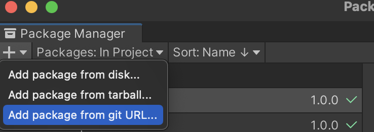

# GRUnityTools
GRTools 是一个集成多种工具的 Unity Package，持续扩充中    

## 集成方式

#### 直接下载

直接下载源码放入项目中使用，注意模块间的引用  

#### 修改 manifest.json

在` ./Pacakges/manifest.json` 添加对应模块，格式为 `"com.warlg.grtools.[模块名]": "https://github.com/Warl-G/GRUnityTools.git#[模块名]@[版本号]"`，@[版本号] 为可选字段，需加入依赖模块的 UPM 地址

#### 使用 PackageManager  

输入各模块 Git 地址即可

#### OpenUPM

暂不支持

#### GRTools.GitPackageResolver  

无论用何种方式导入，强烈建议优先导入 `GRTools.PackageResolver` ，导入后可在 PackageManager 中 `GRTools.PackageResolver`详情界面直接导入其他模块，并且可在其他模块详情信息导入其依赖模块

## 文档  

各个工具的详细文档可在 Assets/GRTools/*/DOCUMENTS~ 下查看   

## 模块

### [GRTools.GitPackageResolver](Assets/GRTools/GitPackageResolver/Documentation~/DOCUMENT.md)   

`"com.warlg.grtools.gitpackageresolver": "https://github.com/Warl-G/GRUnityTools.git#GRTools.GitPackageResolver"`  

由 [GitDependencyResolverForUnity](https://github.com/mob-sakai/GitDependencyResolverForUnity) 改写，用于解析 Git 制作的 Unity Pakcage 依赖，并集成了 GRTools 所有工具，可通过 PackageManager `GRTools.GitPackageResolver`详情一键导入  

### [GRTools.Utils](Assets/GRTools/Utils/Documentation~/DOCUMENT.md)  

 `"com.warlg.grtools.utils": "https://github.com/Warl-G/GRUnityTools.git#GRTools.Utils"`

GRTools 的通用工具包，部分模块引用该包体内容

1. newtonsoft-json  

   第三方 Json 解析工具，Unity 配置了官方引用包，Utils 在此直接引用作为桥接，详见[官网](https://www.newtonsoft.com/json)

2. CsvParser  

   csv 解析工具，可以四种模式解析 csv，详见[文档](Assets/GRTools/Utils/Documentation~/Utils.md)

### [GRTools.Thread](Assets/GRTools/Thread/Documentation~/DOCUMENT.md)   

`"com.warlg.grtools.thread": "https://github.com/Warl-G/GRUnityTools.git#GRTools.Thread"`

GRTools 的线程工具包  

1. Loom

   网上流传比较广泛的 Unity 主线程回归方案

2. TaskQueue

   一个实现了同步串行、异步串行、同步并行、异步并行的多线程任务队列工具，详见[文档](Assets/GRTools/Thread/Documentation~/TaskQueue.md)，[编写教程](https://warl-g.github.io/posts/unity-taskqueue/)     

### [GRTools.Sqlite](Assets/GRTools/DataBase/Sqlite/Documentation~/DOCUMENT.md)  

`"com.warlg.grtools.sqlite": "https://github.com/Warl-G/GRUnityTools.git#GRTools.Sqlite"`

[文档](Assets/GRTools/DataBase/Sqlite/Documentation~/SqliteHelper.md)，，需引用 GRTools.Thread

对 `Mono.Sqlite.Data` 的二次封装和配合 `TaskQueue` 制作的数据库快捷操作和操作队列工具

### [GRTools.Localization](Assets/GRTools/Localization/Documentation~/DOCUMENT.md)  

`"com.warlg.grtools.localization": "https://github.com/Warl-G/GRUnityTools.git#GRTools.Localization"`

[编写教程](https://warl-g.github.io/posts/Unity-Localization/)

GRTools 的本地化工具包，需引用 GRTools.Utils  

多语言工具，无需修改代码即可扩充支持语言，有极强的可扩展性，可自定义文件加载、解析方式  

支持文本与资源自动切换，支持 `Text`、`Text Mesh`、`Image`、`Sprite` 和 `SpriteRender` 的自动更新脚本

已扩展 `Resources`、`AssetBundle` 和 `Addressables` 三种本地化资源管理方式

已扩展 txt（自定义解析规则）、csv 和 json 三种文本解析格式  

### [GRTools.Localization.Addressables](Assets/GRTools/LocalizationExtra/LocalizationAddressables/Documentation~/DOCUMENT.md)   

`"com.warlg.grtools.localization.addressables": "https://github.com/Warl-G/GRUnityTools.git#GRTools.Localization.Addressables"`

GRTools 的本地化工具的扩展包，需引用 GRTools.Localization   

为本地化资源加载扩展 Addressables 支持，详见`GRTools.Localization`  

### [GRTools.Localization.TextMeshPro](Assets/GRTools/LocalizationExtra/LocalizationTMP/Documentation~/DOCUMENT.md)   

`"com.warlg.grtools.localization.tmp": "https://github.com/Warl-G/GRUnityTools.git#GRTools.Localization.TextMeshPro"`

GRTools 的本地化工具的扩展包，需引用 GRTools.Localization   

为本地化工具添加 TextMeshPro 支持，详见`GRTools.Localization`  